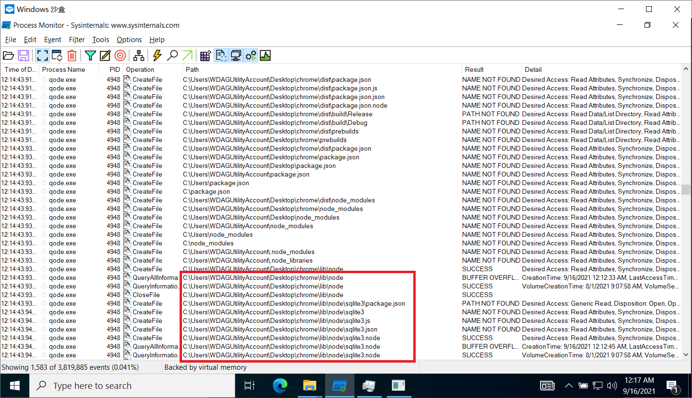

# How to install native modules#
https://react.nodegui.org/docs/guides/using-native-node-modules
`npm rebuild --nodedir=.\..\..\node_modules\@nodegui\qode\binaries\qode.exe`
`npx qode /path/to/npm rebuild`

## node-dpapi
switch to the same version of node.
```
$ nvm list
  * 16.4.0 (Currently using 64-bit executable)
    14.17.3
$ npm rebuild
$ npm pack local-package\node-dpapi
$ npm install bradhugh-node-dpapi-1.0.3.tgz
```
PowerShell: `npm install (npm pack local-package\node-dpapi)`

# package
* vc_redist.x64.exe
`set VCINSTALLDIR=C:\Program Files (x86)\Microsoft Visual Studio\2017\BuildTools\VC`

# qode Crash with native node 
1. externals: { 'sqlite3': 'commonjs sqlite3' },
2. `./lib/node/${module}.node`

3. main window is able to open, but will crash while calling the sqlite.
** sqlite3 JavaScript is `externals`?

# diagnosis
`https://docs.microsoft.com/en-us/sysinternals/downloads/procmon`
`https://www.dependencywalker.com/`
